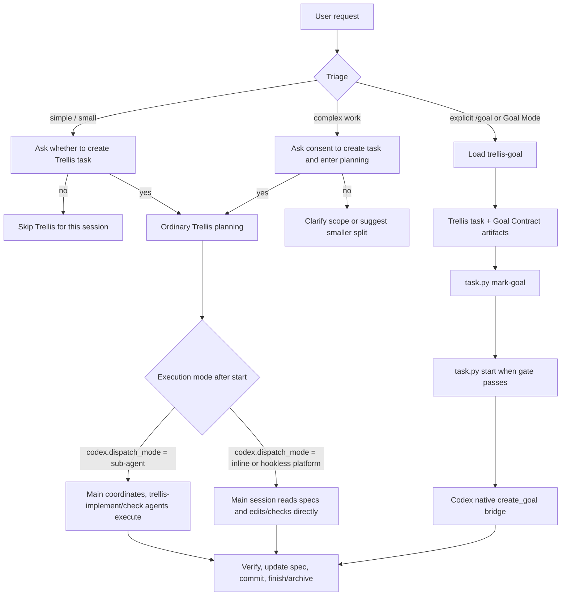
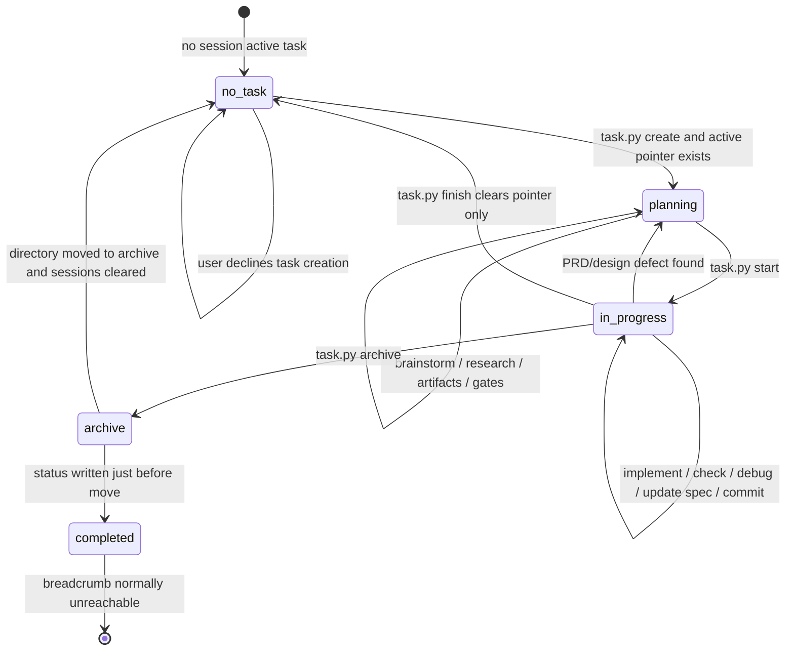
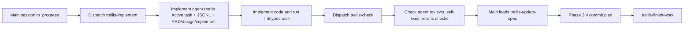
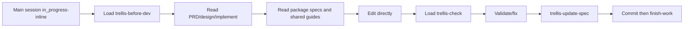
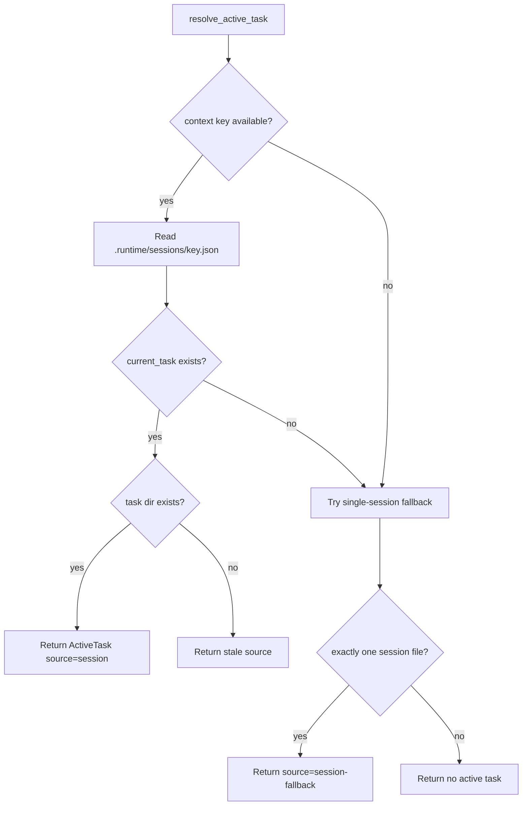
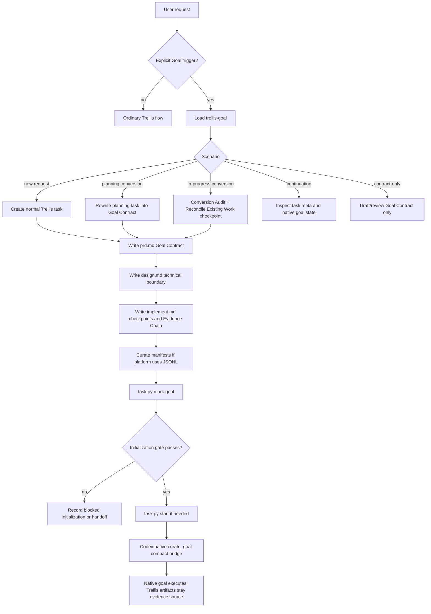
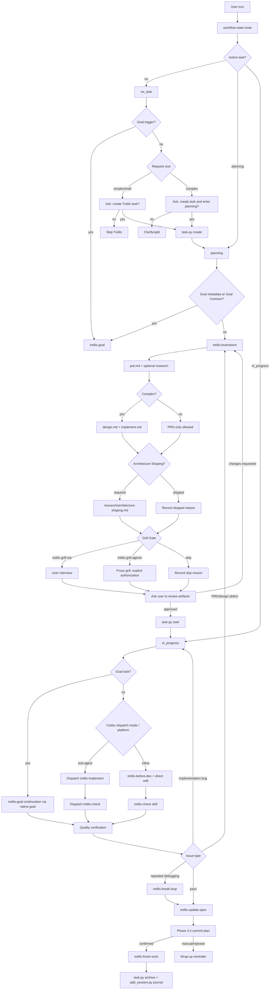

# Trellis workflow audit

- Query: 完整审视当前魔改后的 Trellis workflow、mode、branch、skill、script 和优化机会。
- Scope: internal repository evidence, no source-code modification.
- Date: 2026-06-05

## 0. 结论先行

用户问“一共有三种模式? 普通 子agent goal?”，可以作为高层心智模型，但不是 Trellis 的全部层级。

更准确的模型是：

| 层级 | 现有形态 | 说明 |
|---|---|---|
| Collaboration / execution mode | ordinary / inline, sub-agent dispatch, Codex native Goal Mode bridge | 回答“普通、子agent、goal”的问题。它们描述谁执行、是否委托、是否桥接 native goal。 |
| Lifecycle phase | `no_task`, `planning`, `in_progress`, `completed/archive` | Trellis 的任务状态机和 per-turn breadcrumb 的核心。 |
| Skill router | `trellis-start`, `trellis-brainstorm`, `trellis-goal`, `trellis-check`, etc. | 不同阶段加载不同 skill，skill 不是 mode。 |
| Runtime substrate | `task.py`, active-task session pointer, JSONL context, hooks, spec, journal | 负责实际文件状态、上下文注入、归档和记录。 |

所以可以说有“三大执行模式”：

1. **普通 Trellis flow / inline variant**: 主会话自己规划、读 spec、实现、检查、提交、finish。Codex 默认逻辑在 hook/script 中是 inline，但当前项目 `.trellis/config.yaml` 显式设置 `codex.dispatch_mode: sub-agent`，所以本仓库当前不是 inline 默认体验。
2. **sub-agent dispatch flow**: 主会话协调和把关，`trellis-implement` / `trellis-check` / `trellis-research` 等 sub-agent 执行边界内工作。当前 Codex 配置使用此模式。
3. **Trellis Goal / Codex native Goal Mode bridge**: 只有显式 `/goal`、Goal Mode、unattended、long-running autonomous execution 或 Goal Contract 请求才进入。Trellis 准备 `prd.md` / `design.md` / `implement.md` 和 `task.json.meta.trellis_goal`，再桥接到 Codex native `create_goal`。它不是本地循环执行器。

同时还有几个不是“三种模式”之一、但很重要的辅助流程：

- `trellis-brainstorm`: Phase 1 requirements discovery。
- `trellis-architecture-shaping`: architecture-sensitive planning gate。
- `trellis-grill-me` / `trellis-grill-agents`: planning artifact pressure-test。
- `trellis-break-loop`: repeated-debug retrospective。
- `trellis-update-spec`: knowledge capture。
- `trellis-finish-work`: archive + journal wrap-up。
- `trellis-meta` / `trellis-spec-bootstarp`: 修改 Trellis 本身和初始化/刷新 spec 的 meta flow。

本报告没有使用 AI 生图。原因：流程图是结构化状态机和分支图，Mermaid 更准确、可复制、可维护，也避免使用外部 image API 和任何 secret。

## 1. Evidence map

主要证据文件：

| Area | Evidence |
|---|---|
| Canonical workflow | `.trellis/workflow.md` |
| Per-turn breadcrumb contract | `.trellis/spec/cli/backend/workflow-state-contract.md` |
| Startup / continuation | `.agents/skills/trellis-start/SKILL.md`, `.agents/skills/trellis-continue/SKILL.md` |
| Planning | `.agents/skills/trellis-brainstorm/SKILL.md`, `.agents/skills/trellis-architecture-shaping/SKILL.md` |
| Grill Gate | `.agents/skills/trellis-grill-me/SKILL.md`, `.agents/skills/trellis-grill-agents/SKILL.md` |
| Goal bridge | `.agents/skills/trellis-goal/SKILL.md`, `.agents/skills/trellis-goal/references/*.md` |
| Execute / check / finish | `.agents/skills/trellis-before-dev/SKILL.md`, `.agents/skills/trellis-check/SKILL.md`, `.agents/skills/trellis-update-spec/SKILL.md`, `.agents/skills/trellis-finish-work/SKILL.md` |
| Runtime scripts | `.trellis/scripts/task.py`, `.trellis/scripts/common/task_store.py`, `.trellis/scripts/common/active_task.py`, `.trellis/scripts/common/task_context.py`, `.trellis/scripts/common/tasks.py`, `.trellis/scripts/common/session_context.py`, `.trellis/scripts/common/workflow_phase.py` |
| Codex platform files | `.codex/hooks/inject-workflow-state.py`, `.codex/agents/trellis-implement.toml`, `.codex/agents/trellis-check.toml`, `.codex/agents/trellis-research.toml` |
| Context injection model | `.agents/skills/trellis-meta/references/local-architecture/context-injection.md`, `.agents/skills/trellis-meta/references/platform-files/agents.md` |
| Local config | `.trellis/config.yaml` |

重要观察：

- 当前 `.trellis/config.yaml` 设置 `codex.dispatch_mode: sub-agent`。
- `.codex/hooks/inject-workflow-state.py` 会额外注入 `<codex-mode>`，说明当前 Codex mode。
- `completed` workflow-state block 在普通 archive flow 中基本不可达，因为 `task.py archive` 写 `status=completed` 后马上移动目录并清理 session pointer。
- 很多中文模板/输出存在 mojibake，例如 `鈫?`、`鐩爣`、`寰呰ˉ鍏`，这是高价值优化点。

## 2. Overall mode map

## 3. Lifecycle state machine

关键点：

- `task.py create` 写 `task.json.status = "planning"`，并在有 session identity 时 best-effort 设置 active-task pointer。
- `task.py start` 写 `status = "in_progress"`，但只在当前 status 是 `planning` 时翻转。
- `task.py finish` 只清理 active-task pointer，不代表任务完成。
- `task.py archive` 写 `status = "completed"`、移动目录到 `archive/YYYY-MM/`、清理 session pointer，并可能 auto-commit archive。
- `completed` block 保留给未来显式完成状态设计；当前普通流程中无法稳定触发。

## 4. Phase and branch inventory

### 4.1 `no_task`

触发：active-task resolver 没有找到当前 session 的 task pointer。

主要分支：

| Branch | Current behavior | 特点 | 优化判断 |
|---|---|---|---|
| Simple conversation / small task | 只问是否创建 Trellis task；用户说 no 则跳过 Trellis | 避免小事过度流程化 | 合理，建议保留 |
| Complex task | 问是否创建 task 并进入 planning | 防止未授权创建文件 | 合理，已执行本任务 |
| Explicit Goal Mode | 加载 `trellis-goal` | Goal entry 受严格触发词控制 | 合理，避免把普通多步任务误升 Goal |
| User refuses task creation | 解释、澄清或建议缩小 | 尊重用户意愿 | 合理 |

### 4.2 Phase 1: Plan

Required steps:

1. `1.0 Create task`: 只有用户同意后创建。
2. `1.1 Requirement exploration`: 加载 `trellis-brainstorm`，写 `prd.md`；复杂任务还需要 `design.md` 和 `implement.md`。
3. `1.2 Research`: optional but complex tasks recommended；research 写入 `research/`。
4. `1.3 Configure context`: sub-agent-capable platform curator writes `implement.jsonl` / `check.jsonl`；inline platform skips JSONL curation。
5. `1.4 Activate task`: artifact review 后 `task.py start`。
6. `1.5 Completion criteria`: artifact/gate/user approval/start status。

核心分支：

| Branch | Behavior | 特点 | 优化判断 |
|---|---|---|---|
| Lightweight | PRD-only 可以启动，但仍要 Grill Gate decision | 降低小任务成本 | 合理 |
| Complex | 必须 `prd.md` + `design.md` + `implement.md` | 强化可恢复性 | 合理 |
| Architecture Shaping required | 写 `research/architecture-shaping.md`，并在 design/implement 引用 accepted constraints | 防止 toy-MVP | 合理，但执行依赖 AI 自律 |
| Architecture Shaping skipped | 必须写 evidence-backed low-risk reason | 可审计 | 合理 |
| `trellis-grill-me required` | 用户参与，一问一答 | 处理用户-owned 决策 | 合理 |
| `trellis-grill-agents required` | 用户显式授权 proxy/unattended answer 才用 | 防止 AI 代替用户决定 | 合理，但依赖平台 sub-agent 可用性 |
| `skip grill` | 仅当 mechanical/low-risk/explicit acceptance | 降低流程成本 | 合理 |
| Parent/child split | parent owns requirement map and integration; child owns deliverable | 适合多交付物 | 合理 |
| Sub-agent mode context | curate JSONL before start | 提升 agent context | 可优化，见 P1 建议 |
| Inline mode context | skip JSONL, Phase 2 由 `trellis-before-dev` 读 spec | 简化 hookless platform | 合理 |

### 4.3 Phase 2: Execute

Required steps:

1. `2.1 Implement`
2. `2.2 Quality check`
3. `2.3 Rollback` on demand

Sub-agent flow:

Inline flow:

Rollback branches:

| Trigger | Route |
|---|---|
| Check reveals PRD defect | Return to Phase 1, update `prd.md`, then redo implement/check |
| Implementation went wrong | Revert current-task code changes, redo implement |
| Need more research | Write `research/`, then continue |
| Repeated debugging | Load `trellis-break-loop`, classify root cause, update specs |

### 4.4 Phase 3: Finish

Steps:

1. `3.1 Quality verification`: final `trellis-check` pass.
2. `3.2 Debug retrospective`: optional `trellis-break-loop` when repeated bugfix loop happened.
3. `3.3 Spec update`: required `trellis-update-spec` judgment.
4. `3.4 Commit changes`: main session drafts batched commit plan and asks one-shot confirmation.
5. `3.5 Wrap-up reminder`: tell user `/trellis:finish-work` can archive and journal.

`trellis-finish-work` itself:

1. `get_context.py --mode record` to survey active tasks, git, commits.
2. classify dirty paths; bail if current-task code is still uncommitted.
3. archive current task and any confirmed extra tasks.
4. record journal with `add_session.py`.

特点：

- Commit and finish are intentionally separated.
- `finish-work` must not commit code; code commits happen in Phase 3.4.
- Archive and journal may auto-commit Trellis bookkeeping depending on `session_auto_commit`.

## 5. Skill inventory and optimization review

| Skill | Role | Trigger | Output / state | 特点 | Optimization review |
|---|---|---|---|---|---|
| `trellis-start` | Session bootstrap | start/resume/new task | Runs `get_context`, phase, packages | 建立开发者、git、task、journal、spec context | Good. Some output suffers from mojibake through underlying templates. |
| `trellis-continue` | Resume router | current task exists | Picks next phase/step | Reduces “where am I?” confusion | Good. Could add machine-readable gate check to reduce subjective routing. |
| `trellis-brainstorm` | Requirement discovery | unclear/complex task | `prd.md`, optionally `design.md`, `implement.md` | Evidence-before-question, one question at a time | Strong. Current task use-case fits. Could include a built-in “audit/report-only task” branch. |
| `trellis-architecture-shaping` | Architecture planning | modules/contracts/testability/durable behavior | `research/architecture-shaping.md` | Prevents toy-MVP collapse | Good. Could expose a lightweight “analysis-only skip” template, since read-only audit often touches architecture topics without implementation. |
| `trellis-grill-me` | Attended Grill Gate | user-owned decisions | updated artifact / blocker | User participates; one question at a time | Good. |
| `trellis-grill-agents` | Proxy Grill Gate | explicit unattended/proxy authorization | transcript/ledger/artifact revisions | Requires real interviewer sub-agent, stops on human-owned decisions | Good concept. Needs clear platform-unavailable behavior in user-facing flows. |
| `trellis-before-dev` | Pre-edit spec loading | inline implementation | reads artifacts/specs/guides | Mandatory before code | Good. Mainly for inline/hookless flow. |
| `trellis-check` skill | Inline/final quality check | after edits / before commit | fixes or reports issues | Includes lint/typecheck/tests/spec sync/cross-layer dimensions | Good. Could replace `grep` example with `rg` to match project convention. |
| `trellis-break-loop` | Debug retrospective | repeated fixes | root cause + prevention + spec updates | Turns bugfix into institutional memory | Good. Contains strong “must update specs” instruction; could align with Phase 3.3 so it does not feel like duplicate spec-update flow. |
| `trellis-update-spec` | Capture code-spec | new learning/feature/bug | `.trellis/spec/` changes | Demands executable contracts | Good. It is rigorous but heavy; could add explicit “nothing to update” report template. |
| `trellis-finish-work` | Wrap up | after code commits | archive + journal | Keeps work commit, archive commit, journal commit ordered | Strong. Could benefit from automated dirty-path classifier/preflight. |
| `trellis-goal` | Goal bridge | explicit Goal Mode/unattended/Goal Contract | Trellis Goal Contract + `create_goal` bridge | Strict ownership boundary, no local loop | Strong. Biggest risk is accidental over-trigger, but current no-goal rule is clear. |
| `trellis-meta` | Local Trellis customization | modifying `.trellis`, hooks, skills, commands | guidance files | Treats local project as source of truth | Good. |
| `trellis-spec-bootstarp` | Build/refresh `.trellis/spec` | spec bootstrap/refactor | codebase-backed specs | Platform-neutral single-owner loop | Good, but name typo `bootstarp` is user-visible and should be fixed or aliased. |
| Project support skills | `contribute`, `first-principles-thinking`, `python-design`, `ts-sdk-author` | domain-specific support | guidance | Not core task lifecycle | Useful, but should not be confused with Trellis workflow modes. |

## 6. Script and runtime inventory

### 6.1 `task.py` command surface

| Command | Function |
|---|---|
| `create` | Create task directory, `task.json`, `prd.md`; seed JSONL when sub-agent platform exists; optionally parent link; auto-activate if session identity exists. |
| `add-context` | Add spec/research file or directory entry to `implement.jsonl` / `check.jsonl`. |
| `validate` | Validate JSONL paths; seed rows without `file` are skipped. |
| `list-context` | Show curated JSONL entries. |
| `start` | Set active task and flip `planning -> in_progress`; degraded mode flips status without pointer if no session identity. |
| `current` | Show active task and source. |
| `finish` | Clear active task pointer only. |
| `set-branch` / `set-base-branch` / `set-scope` | Task metadata for branch/PR/scope. |
| `mark-goal` | Write `task.json.meta.trellis_goal`. |
| `goal-info` | Print goal metadata, hierarchy, checkpoint counts. |
| `archive` | Mark completed, move to archive, clear sessions, run archive hooks, maybe auto-commit. |
| `list` / `list-archive` | Display active/archive tasks. |
| `add-subtask` / `remove-subtask` | Bidirectional parent/child links. |

Optimization review:

- The command surface is coherent.
- `task.py start` does not enforce artifact gates; Trellis relies on AI workflow instructions. This is flexible but allows accidental starts.
- `mark-goal` writes metadata but does not validate the Goal Contract quality gate.
- `goal-info` checkpoint parser is markdown-shape dependent (`### Checkpoint N:` plus `- Status:`). It is simple but brittle.

### 6.2 Active task runtime

Active task is stored per session under `.trellis/.runtime/sessions/<context-key>.json`.

Resolution branches:

特点：

- Multi-session isolation is prioritized.
- Class-2 platform sub-agents can use single-session fallback when exactly one session file exists.
- Main dispatch prompt still must start with `Active task: <path>` for Codex sub-agents, because context inheritance can fail.

Optimization review:

- Good safety model.
- Diagnostics could be clearer when fallback refuses due to multiple session files.
- `task.py start` degraded mode message is useful but mojibake affects readability.

### 6.3 Context injection

Trellis uses four context channels:

| Channel | Source | Purpose |
|---|---|---|
| Session context | `get_context.py` / `session_context.py` | developer, git, active task, tasks, journal, packages |
| Workflow-state breadcrumb | `.trellis/workflow.md` blocks parsed by hook | per-turn next action |
| Task artifacts | `prd.md`, `design.md`, `implement.md`, `research/` | durable task truth |
| Spec manifests | `implement.jsonl`, `check.jsonl`, `.trellis/spec/` | sub-agent spec/research loading |

Platform context modes:

| Platform family | Context mode |
|---|---|
| Hook-inject platforms | Hook injects JSONL files and task artifacts before agent starts |
| Pull-prelude platforms such as Codex | Agent definition instructs agent to read task context |
| Extension-backed platforms such as Pi | Extension prompt builder |
| Hookless inline platforms | Main session follows skills/workflow and reads files directly |

Current Codex agent definitions explicitly:

- forbid recursive `trellis-implement` / `trellis-check` spawning,
- require resolving `Active task: <path>` from dispatch prompt first,
- read JSONL, then task artifacts,
- fall back to package spec discovery if JSONL is seed-only.

This is a strong design. It addresses the classic sub-agent deadlock / context-loss failure mode.

## 7. Goal Mode branch

Goal Mode is a bridge, not a fourth local executor.

Entry modes from `trellis-goal`:

| Entry mode | Trigger | Important rule |
|---|---|---|
| New goal request | `/goal`, Goal Mode, unattended/long-running request | Create normal Trellis task first, then Goal Contract, then `mark-goal`, then `create_goal`. |
| Planning task conversion | existing planning task should become goal | Preserve useful PRD material, rewrite goal-facing sections. |
| In-progress conversion | already started task becomes goal | Conversion Audit, do not reset status. |
| Continuation | task has goal metadata or Goal Contract | Inspect `get_goal`, use `goal-info`, continue only active native goal. |
| Contract-only | user asks to draft/review goal text | Do not create/mark/start/bridge task. |

Key hard boundaries:

- Trellis owns artifacts and task lifecycle.
- Codex native goal owns active unattended goal state.
- `implement.md` checkpoints are evidence/recovery landmarks, not a local queue.
- Parent/child tasks remain normal Trellis hierarchy, not fan-out native goals.
- Token budget is passed only if the user explicitly supplied one.
- Current Plan mode should block native handoff; do not simulate Goal Mode locally.

Optimization review:

- The boundary is well-defined and avoids local “fake goal runner”.
- `mark-goal` could validate required Goal Contract sections before writing metadata.
- Goal checkpoint parsing could use a more structured artifact or at least a validator.
- Some trigger examples in `trellis-goal` frontmatter appear mojibake, which can reduce routing clarity for Chinese users.

## 8. Combined flow review

### 8.1 Ordinary task + sub-agent dispatch

Strengths:

- Main session remains accountable for planning, user clarification, spec updates, commits, and finish.
- Implement/check agents have explicit context loading and recursion guards.
- `check` can self-fix, reducing ping-pong.

Risks:

- If `Active task:` is missing from the dispatch prompt and multiple session files exist, Codex sub-agent may not find the task.
- If JSONL is seed-only, agent falls back to selecting specs itself, which can work but weakens planning-time context curation.
- Check agent has write access and can alter code during review, which is intended but should stay visible in final report.

Optimizations:

- Add a pre-dispatch check that verifies the prompt begins with `Active task:`.
- Add `task.py validate --gates` or similar to report missing artifact/gate/context curation before `start`.
- Make check-agent final output require “Files changed during check” even when no issue is found.

### 8.2 Ordinary task + inline

Strengths:

- Less moving context across agents.
- Good for small/local tasks and hookless platforms.
- `trellis-before-dev` covers spec discovery.

Risks:

- Main session must remember to run all gates and checks.
- Large tasks lose parallelism and independent review pressure.

Optimizations:

- Keep inline default only where sub-agent isolation makes context unreliable.
- In Codex, make `codex.dispatch_mode` wording consistent across config comments, hook comments, and `workflow_phase.py`.

### 8.3 Planning + Architecture Shaping + Grill Gate

Strengths:

- Good separation: architecture shaping handles technical maintainability; Grill Gate handles artifact pressure and user decisions.
- Both write durable artifacts.

Risks:

- Both are instructions, not enforced by scripts.
- Complex tasks can accidentally skip one if the AI is rushed.

Optimizations:

- Add a planning preflight command that checks:
  - complex task has `design.md` and `implement.md`;
  - architecture decision is present;
  - Grill Gate decision is present;
  - `implement.jsonl` / `check.jsonl` either curated or explicitly skipped for inline.

### 8.4 Goal + Grill Agents

Strengths:

- Goal Mode delegates low/medium technical decisions but preserves high-risk/user-owned boundaries.
- Medium ambiguity uses `trellis-grill-agents` as pressure test, not as execution controller.

Risks:

- If platform sub-agents are unavailable, `trellis-grill-agents` must block rather than self-critique.
- Distinguishing “medium technical ambiguity” from “user-owned scope preference” requires discipline.

Optimizations:

- Add a small ambiguity classification template to Goal `implement.md`.
- Make `trellis-grill-agents` run artifact naming and summary fields easier to validate.

### 8.5 Parent/child + Goal

Strengths:

- Parent can own the Goal Contract; children can own evidence units.
- `goal-info` reports hierarchy, checkpoint counts, warnings.

Risks:

- Users may assume child tasks are dependency/order semantics, but docs say they are not.
- A child marked as goal is independent, not auto-run; this is easy to misunderstand.

Optimizations:

- In `task.py goal-info`, print an explicit warning when a child has `trellis_goal.enabled`.
- In parent PRD template, add a short “child tasks are not dependencies” line.

### 8.6 Finish/archive + journal

Strengths:

- Enforces clean separation:
  - work commits first,
  - archive commit,
  - journal commit.
- `finish-work` refuses to continue if current-task code changes are dirty.

Risks:

- Dirty-path classification is currently manual/heuristic.
- Archive status flips to `completed` but breadcrumb cannot use it in normal flow.

Optimizations:

- Add a `task.py prefinish` or `finish-work --dry-run` that outputs dirty-path classification candidates.
- Decide whether to remove the dead `completed` breadcrumb from user-facing phase index or add an explicit reachable `task.py complete` state.

## 9. Optimization backlog

### P0 / high value

| Priority | Issue | Evidence | Impact | Suggested optimization |
|---|---|---|---|---|
| P0 | Mojibake in Chinese text across templates and outputs | `workflow.md`, `task_store.py`, several skills show `鈫?`, `鐩爣`, `寰呰ˉ鍏` | User-facing workflow is hard to read; Chinese trigger examples may fail semantic routing | Normalize encoding in generated templates and local files; add regression test that key Chinese phrases survive init/update on Windows. |
| P0 | Planning gates are instruction-only, not script-enforced | `workflow.md` requires Architecture Shaping and Grill Gate before `start`; `task.py start` only flips status | Accidental `start` can bypass planning quality gates | Add `task.py validate --phase start` or `task.py start --check-gates` default soft-block with override. |
| P0 | Goal metadata can be written without Goal Contract validation | `cmd_mark_goal` writes `meta.trellis_goal`; validation is in skill docs only | A task can look like a goal but lack required contract/evidence fields | Add `task.py mark-goal --validate` default or companion `goal-validate`. |

### P1 / medium-high value

| Priority | Issue | Evidence | Impact | Suggested optimization |
|---|---|---|---|---|
| P1 | `completed` breadcrumb is dead in normal flow | workflow-state contract says `completed` is unreachable after archive | Confusing for maintainers and users reading flow | Either introduce explicit `task.py complete` before archive, or label completed block as internal/future only in concise user-facing docs. |
| P1 | Codex dispatch default wording is inconsistent | `workflow_phase.py` and hook default to inline, config comment says default sub-agent preserves behavior, current config sets sub-agent | Agents may misunderstand which variant is expected | Align comments and docs: default value, local override, current mode banner. |
| P1 | JSONL curation can silently remain seed-only | `task_context.py` skips seed rows; Codex agents fallback to selecting specs themselves | Complex tasks may lose curated spec/research context | Add planning preflight warning when complex task has seed-only JSONL in sub-agent mode. |
| P1 | Goal checkpoint parser is markdown-shape brittle | `_parse_goal_checkpoints` expects `### Checkpoint N:` and `- Status:` | Goal progress summary can miss checkpoints | Add a checkpoint linter or structured mini-schema section. |
| P1 | `trellis-spec-bootstarp` name typo is user-visible | skill directory/name | Search/discovery friction and polish issue | Add alias or rename with migration compatibility. |
| P1 | `trellis-check` suggests `grep` in code reuse checklist | skill file | Minor mismatch with project convention to use `rg` | Replace example with `rg` and fallback note. |

### P2 / polish and robustness

| Priority | Issue | Evidence | Impact | Suggested optimization |
|---|---|---|---|---|
| P2 | Sub-agent context failure diagnostics could be clearer | active task fallback refuses when 0 or multiple session files | Agent may ask user instead of explaining exact fix | Print/record diagnostic: missing `Active task:` prompt, multiple session files, no context key. |
| P2 | Check agent write access is powerful | `.codex/agents/trellis-check.toml` self-fixes | Good when intended; surprising if unreported | Require changed-file summary even for check-phase fixes. |
| P2 | `finish-work` dirty-path classification is manual | skill instructions | Can be slow in dirty repos | Add script helper to propose current-task vs unrelated dirty paths based on task artifacts and diff. |
| P2 | Parent/child semantics can be misunderstood as dependencies | workflow/docs state tree is not dependency system | Misordered implementation expectations | Add explicit warning in parent task templates or `task.py list` help. |
| P2 | AI image config exists but not needed for workflow diagrams | `D:\Documents\codex-pet\assets\生图工具.txt` | Risk of unnecessary external call / secret exposure | Keep diagrams in Mermaid; only use image generation for visual poster deliverables. |

## 10. Full branch diagram

## 11. Feature-by-feature summary

### Task system

特点：

- Task directory is durable source: `task.json`, `prd.md`, optional `design.md`, optional `implement.md`, JSONL manifests, research.
- `task.py create` now seeds JSONL only when sub-agent-capable platform config exists.
- Parent/child links are ordinary hierarchy, not dependency engine.

可优化：

- Add gate validation before start.
- Add clearer parent/child semantics in generated PRD or CLI output.
- Add diagnostic for duplicate archived task slug errors with suggested slug.

### Spec system

特点：

- `.trellis/spec/` stores implementation contracts and guides.
- Index files point to specific guideline docs.
- `trellis-before-dev` and sub-agent JSONL drive spec loading.

可优化：

- Add “spec selection summary” to planning artifacts for complex tasks.
- Make seed-only JSONL warning visible before start in sub-agent mode.

### Workspace memory

特点：

- `.trellis/workspace/<developer>/journal-N.md` records sessions.
- `add_session.py` rotates journal around max lines and can auto-commit.

可优化：

- In dirty repos, journal/archive auto-commit should keep warning text crisp and non-mojibake.
- Consider a report mode that lists only current-task artifacts changed by this session.

### Hook / breadcrumb

特点：

- `.trellis/workflow.md` is single source of truth for breadcrumb bodies.
- Hook parser has no fallback dict; missing tags degrade visibly.
- Codex hook injects `<codex-mode>` plus workflow-state.

可优化：

- Add local test or command to validate all `[workflow-state:*]` pairs and platform blocks after local edits.
- Resolve comment drift around Codex default mode.

### Sub-agent platform layer

特点：

- Agents define read order and write boundaries.
- Codex agents disable further multi-agent spawning structurally.
- Main session must dispatch with `Active task: <path>`.

可优化：

- Add a dispatch helper template or command that constructs the correct prompt.
- Add agent final-output schema validation for changed files and checks.

### Goal bridge

特点：

- Strong Trellis/Codex ownership split.
- Native goal objective is compact pointer, not a copied contract.
- Goal continuation uses `get_goal` status policy.

可优化：

- Add `goal-validate`.
- Add structured checkpoint linter.
- Fix mojibake in Chinese trigger examples.

## 12. Recommended next steps

Suggested implementation order if the user chooses to optimize after this audit:

1. Fix encoding/mojibake in local Trellis generated files and templates.
2. Add planning/goal validation commands:
   - `task.py validate --phase start`
   - `task.py goal-info --validate` or `task.py goal-validate`
3. Align Codex dispatch-mode documentation and comments.
4. Add JSONL curation warning/preflight for complex sub-agent tasks.
5. Decide the `completed` breadcrumb future:
   - keep explicitly dead and de-emphasize, or
   - add reachable `complete` command before archive.
6. Rename or alias `trellis-spec-bootstarp`.
7. Polish smaller checklist issues such as `grep` -> `rg`.

## 13. Open assumptions

- This audit treats local files in `D:\IdeaProjects\trellis-plus` as authoritative, per `trellis-meta`.
- This audit did not compare every generated upstream template under the external Trellis-Herbivore repo, because the user asked for the current magic-modified local Trellis behavior. The external repo can be used later for drift analysis.
- This audit did not run native `create_goal`, because the user did not request Goal Mode execution.
- This audit did not call any AI image API; Mermaid diagrams satisfy the requested workflow visualization.
